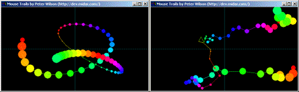



## TechniColor Mouse Trails v 2

### Description

TechniColor Mouse Trails using recursion. Move the mouse over the form to display a colourful rainbow of colours that follow the mouse movement. Click the mouse button to change the Offset values (and thus the patterns). You'll enjoy this, if you like watching pretty colours dance about the screen.
 
### More Info
 

             |
---                |---
**Submitted On**   |2003-09-22 03:07:12
**By**             |[Peter Wilson](https://github.com/Planet-Source-Code/PSCIndex/blob/master/ByAuthor/peter-wilson.md)
**Level**          |Beginner
**User Rating**    |5.0 (25 globes from 5 users)
**Compatibility**  |VB 6\.0
**Category**       |[Graphics](https://github.com/Planet-Source-Code/PSCIndex/blob/master/ByCategory/graphics__1-46.md)
**World**          |[Visual Basic](https://github.com/Planet-Source-Code/PSCIndex/blob/master/ByWorld/visual-basic.md)
**Archive File**   |[TechniColo1648469222003\.zip](https://github.com/Planet-Source-Code/peter-wilson-technicolor-mouse-trails-v-2__1-48687/archive/master.zip)

